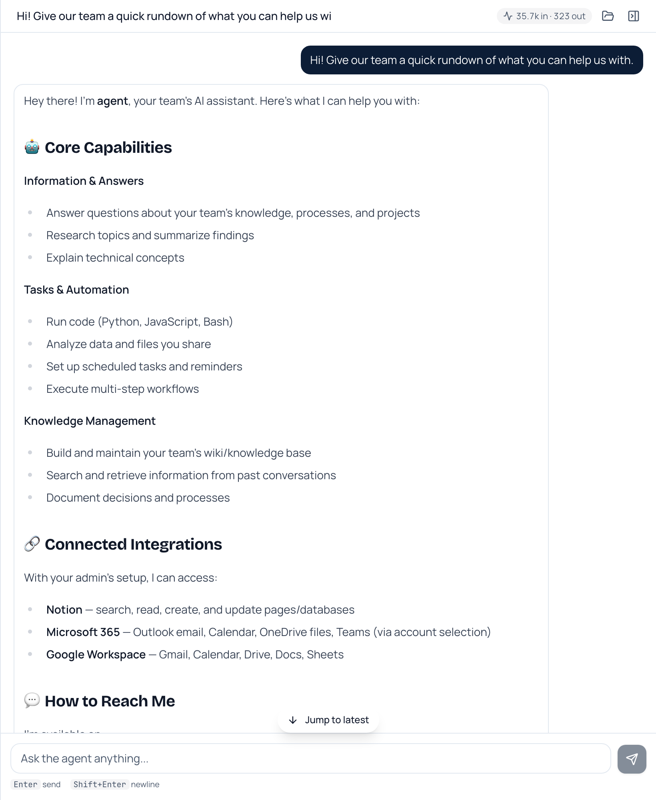
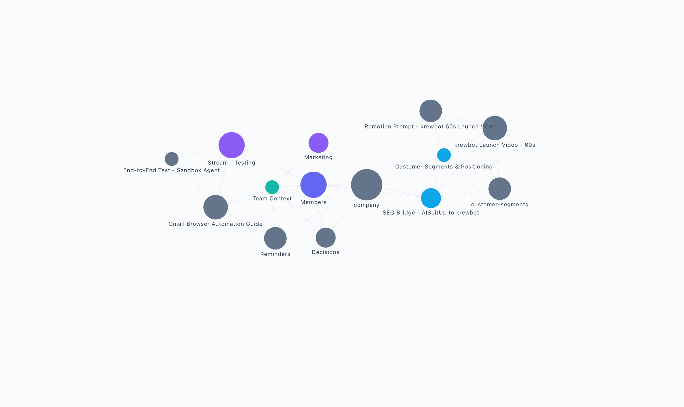
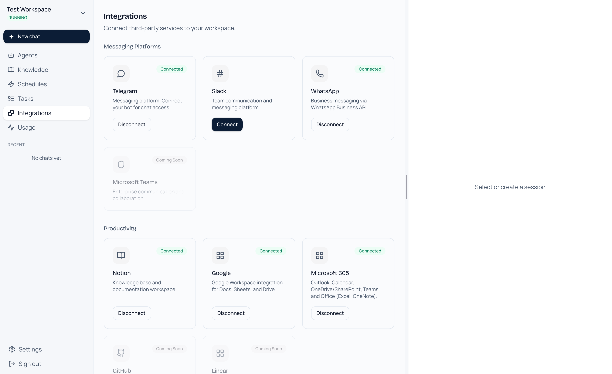
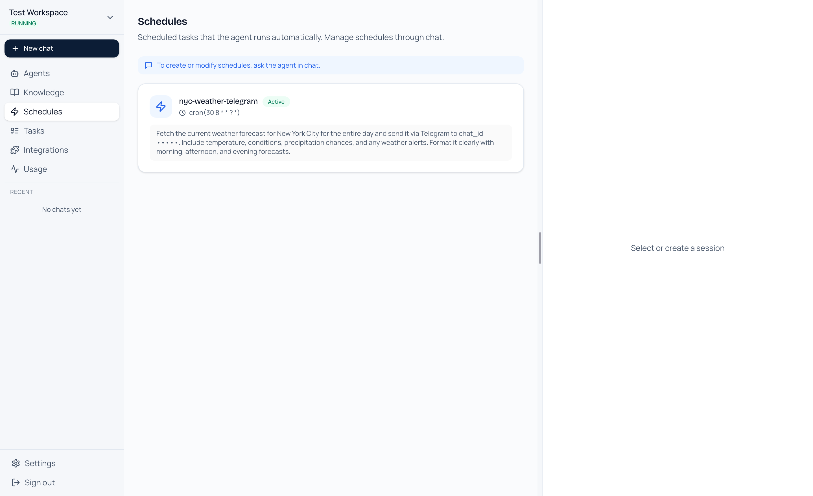
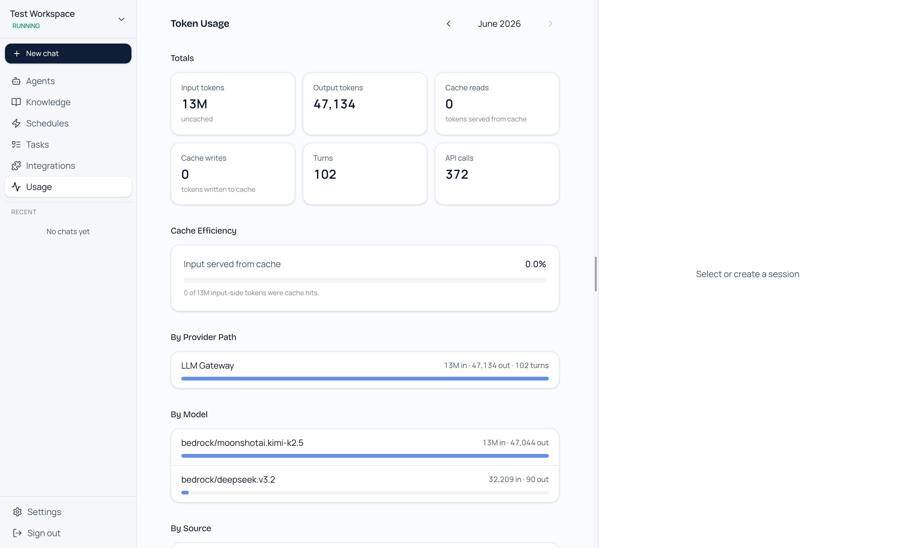

# @krewbot/platform-core

**Give your team an AI agent that actually does the work — chats on every channel, remembers everything, runs on a schedule, and lives in your own cloud.**

Each **workspace** is a private AI agent your team works with — from the web, Slack, WhatsApp, or Telegram. It answers from your team's own knowledge, writes and runs code, browses the web, and carries out work on a schedule. Everything runs in an AWS account you own: your data, your models, your costs.

---

## 💬 An agent that does the work, not just chat

Ask in plain language and get real output back — answers grounded in your team's knowledge, code written and executed, files analyzed, multi-step tasks carried through to the end. The same agent is reachable from the web app and from Slack, WhatsApp, and Telegram, so your team talks to it wherever they already are.

---

## 🧠 A team brain that compounds

The agent builds and maintains a living knowledge base as your team works — decisions, processes, customer notes, project context. Browse it as a connected graph or a structured wiki, search it instantly, and watch it stay current on its own. New hires get a teammate that already knows how things work.

---

## 🔌 Plugged into the tools you already use

Connect the channels your team chats on and the apps your work lives in — one agent, reading and acting across all of them. Messaging through **Slack, WhatsApp, and Telegram**; tools and data through **Google Workspace, Microsoft 365, Notion, GitHub, and Linear**.

---

## ⏰ Work that runs itself

Put the agent on a schedule and it shows up without being asked — morning briefings, recurring reports, reminders, follow-ups. It wakes up, does the work, and delivers the result straight to the channel you choose.

---

## 📊 Every dollar accounted for

See exactly what your agents cost. Each workspace tracks tokens, turns, and spend with monthly rollups broken down by model — and you can cap each workspace with a budget the platform keeps it inside.

---

## And more

- **🤖 Build your own specialists** — spin up purpose-built agents (a standup runner, a data analyst, a support triager), each with its own instructions and tools. The main agent delegates to them automatically.
- **🌐 Agents that use the web** — when the answer isn't in an API, the agent opens a real browser, navigates sites, fills forms, and handles logins — and you can watch it work live.
- **💻 Safe to hand it real work** — every workspace runs in its own hardened sandbox, so you can give the agent code execution, file access, and credentials without the blast radius.
- **👥 A workspace per team** — each team gets its own isolated agent, knowledge, and integrations. Nothing leaks between them.

---

## Run it in your own cloud

Krewbot deploys into an AWS account you control — your conversations, data, and model usage never leave it. Sign-up is admin-controlled, each workspace is network-isolated, and credentials stay sealed away from the agent's sandbox.

**→ [Technical guide](docs/TECHNICAL.md)** — architecture, deployment from an empty AWS account, configuration, and customization.

---

## License

Apache-2.0. See [LICENSE](LICENSE).
