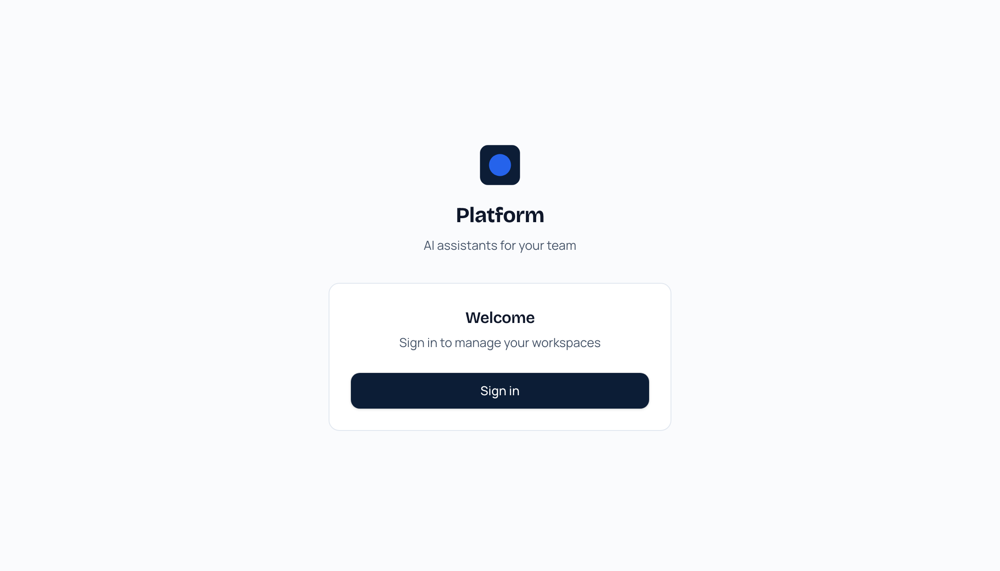

<div align="center">


# @krewbot/platform-core

**Run a team of AI agents — sandboxed, scheduled, and connected to your tools — on infrastructure you own.**

A network-isolated container platform for running untrusted agent code with a team-workspace model on AWS. Brand-neutral and composable: deploy it as-is, or wrap it in a thin *overlay* to add your own branding, billing, and auth.

[](LICENSE)


</div>

---

## What is this?

Each **workspace** is an isolated, gVisor-sandboxed container running a Claude-powered agent that your team chats with — from the web UI or from Slack, WhatsApp, and Telegram. Agents can browse the web, run code, hold a persistent knowledge base, act on a schedule, and do long-running work in the background. The whole platform deploys into **your own AWS account**: your data, your models, your costs.

You don't fork it. You `npm install @krewbot/platform-core`, write a ~5-file overlay, and `cdk deploy`.

---

## ✨ Features

| | |
|---|---|
| 🤖 **Multi-agent workspaces** | Each team workspace is its own gVisor-isolated sandbox with a persistent agent, EFS-backed file storage, and per-workspace secrets. Agents run the real Claude CLI with the Agent SDK. |
| 🛠️ **No-code Agent Creator** | Build, test, and deploy custom sub-agents from the UI — each with its own system prompt, tools, MCP servers, skills, and write-confinement. The supervisor routes tasks to them automatically. |
| 🧠 **Knowledge graph + wiki** | A living, per-workspace knowledge base the agent reads and writes. Browse it as an interactive force-directed **graph** or as a structured wiki, with lexical search and maturity tracking. |
| ⏰ **Scheduled automations** | Cron-style schedules that wake the agent to do work or send messages — "every weekday at 9 AM," "every hour" — delivered to any connected chat. |
| 🌐 **Live browser** | Agents drive a real headless browser (Playwright) to navigate, fill forms, and handle login/MFA flows — and you can watch the session live. |
| 🔌 **Multi-channel integrations** | Talk to the same agent from **Slack, WhatsApp, Telegram**, plus **Google, Microsoft 365, GitHub, and Linear** for tools and data. Per-workspace OAuth, credentials sealed in Secrets Manager. |
| 📋 **Background tasks** | Long-running work runs off the chat thread — kick it off, keep chatting, watch it live, and stop it any time. |
| 📊 **Usage & budgets** | Per-workspace token/spend tracking with monthly rollups. Optionally route models through a shared **LLM gateway** (LiteLLM on Fargate / Bedrock) so provider credentials never touch the sandbox. |
| 🔒 **Isolation by design** | gVisor (`runsc`) runtime, per-workspace IAM and network boundaries, a sidecar that injects secrets the sandbox can't read, and admin-controlled sign-up. |

> 📸 _See the [feature gallery](#-in-action) below for the workspace UI in action._

### Out of the box

With **zero overlay code**, core ships a working single-button Cognito sign-in and a minimal onboarding flow — usable as-is by a self-hosted operator. Branding (name, logo, colors) is a few env vars; deeper customization is opt-in via overlays.

<div align="center">

<br/>
<em>Core's neutral default sign-in — no overlay, no custom code.</em>
</div>

---

## Architecture

```mermaid
flowchart TD
    U([Browser / Slack / WhatsApp / Telegram]) --> CF[CloudFront SPA]
    CF --> MA[Management API<br/>API Gateway + Lambda]
    U -. Cognito hosted UI .-> COG[(Cognito)]
    MA --> DDB[(DynamoDB<br/>workspaces · members · chat · agents)]
    MA --> SF[Step Functions<br/>Provision / Deprovision]
    SF --> WS[Per-workspace<br/>CloudFormation stack]
    WS --> ECS[ECS sandbox task + sidecar<br/>gVisor-isolated agent container]
    ALB[Shared ALB<br/>host-based routing] --> ECS
    U -- &#123;workspaceId&#125;.workspaceZone --> ALB
    ECS -. secrets / SSM / JWKS .- SC[Sidecar sync]
```



- **Control plane** — Management API → DynamoDB → Step Functions → a per-workspace CloudFormation stack deployed by the provision Lambda.
- **Data plane** — one ECS sandbox task + sidecar per workspace, reached at `{workspaceId}.{workspaceZone}` through the shared ALB.
- **Agent runtime** — the sandbox runs a Node.js chat-server + Python MCP servers; the sidecar syncs Secrets Manager + SSM into the container and refreshes JWKS.

---

## Prerequisites

| Need | Notes |
|---|---|
| **Node.js 22** | Matches CI. 20+ likely works. |
| **AWS account + admin** | Programmatic admin (or `AssumeRole`) into the target account. |
| **AWS CLI v2** | For bootstrap, ACM, Cognito, and inspection commands. |
| **A domain you control** | You'll add CNAME records for ACM validation + the app/workspace hosts. |
| **Docker** | To build & push the agent / sidecar / gateway images. |
| `aws-cdk-lib ^2.100` + `constructs ^10` | Peer deps your overlay provides. Core builds against `aws-cdk-lib ^2.170`. |

Docs assume **`us-east-1`** (CloudFront consumes ACM certs only from `us-east-1`).

---

## Quick start: a minimal overlay

A consuming ("overlay") repo is tiny — the bare minimum is five files:

```
my-platform/
├── package.json                        # depends on @krewbot/platform-core
├── cdk.json                            # CDK app entry → bin/app.ts
├── tsconfig.json                       # preserveSymlinks: true (see gotcha)
├── lib/config.ts                       # your single source of config
├── scripts/synth-workspace-template.ts # emits the per-workspace template
└── bin/app.ts                          # composes the platform
```

### 1. Install

```bash
npm install @krewbot/platform-core
# from source: npm install github:<org>/<core-repo>
npm install aws-cdk-lib constructs
npm install -D aws-cdk typescript ts-node @types/node
```

> **Module-resolution gotcha.** When core is linked as a git/`file:` dependency, npm nests a second copy of `aws-cdk-lib`. Without `preserveSymlinks` TypeScript treats the two copies as distinct types and synth fails. Set `"preserveSymlinks": true` in `tsconfig.json` **and** run Node with `NODE_OPTIONS='--preserve-symlinks'`.

### 2. `lib/config.ts` — one config object

`composePlatform` takes a `PlatformConfig`. Prefix every physical name with your own slug so two deployments never collide.

```ts
import * as path from 'path';
import type { PlatformConfig } from '@krewbot/platform-core';
import * as cdk from 'aws-cdk-lib';

export function getConfig(_app: cdk.App): PlatformConfig {
  const NAME = 'myplatform';
  return {
    accountId: '<ACCOUNT_ID>',
    region: 'us-east-1',
    envLabel: 'prod',

    // false for the very first deploy if the ACM cert isn't ISSUED yet —
    // composePlatform then returns only the foundation stacks.
    hasCertificate: true,
    certificateArn: 'arn:aws:acm:us-east-1:<ACCOUNT_ID>:certificate/<uuid>',
    appDomain: 'app.example.com',
    workspaceZone: 'ws.example.com',
    frontendBucketName: `${NAME}-frontend`,     // globally unique

    cognitoDomainPrefix: `${NAME}-auth`,        // globally unique
    agentName: 'Assistant',                     // persona name in the system prompt

    // Pre-synthesized per-workspace template (produced in step 3).
    workspaceTemplatePath: path.join(__dirname, '..', 'assets', 'workspace-template.json'),

    stackIds: {
      ecr: `${NAME}-Ecr`, network: `${NAME}-Network`, storage: `${NAME}-Storage`,
      cluster: `${NAME}-Cluster`, auth: `${NAME}-Auth`, certificate: `${NAME}-Certificate`,
      dataPlane: `${NAME}-DataPlane`, agentPlatformApi: `${NAME}-AgentPlatformApi`,
      managementApi: `${NAME}-ManagementApi`, frontend: `${NAME}-Frontend`,
      workspaceTemplate: `${NAME}-Workspace`,
    },
    storageNames: {
      workspacesTable: `${NAME}-workspaces`,
      workspaceMembersTable: `${NAME}-workspace-members`,
      chatDirectoryTable: `${NAME}-chat-directory`,
      agentsTable: `${NAME}-agents`,
    },
    infrastructureNames: {
      agentRepository: `${NAME}-agent`,
      sidecarRepository: `${NAME}-sidecar`,
      ecsCluster: `${NAME}-cluster`,
      dataPlaneLoadBalancer: `${NAME}-dataplane`,
      platformConfigSsmParameter: `/${NAME}/platform-config`,
      agentPlatformApiName: `${NAME}-agent-platform-api`,
      managementApiName: `${NAME}-management-api`,
      provisionStateMachineName: `${NAME}-provision`,
      deprovisionStateMachineName: `${NAME}-deprovision`,
      ecsTaskStateChangeRuleName: `${NAME}-ecs-task-state-change`,
      userPoolName: `${NAME}-users`,
      userPoolClientName: `${NAME}-web`,
    },
    workspaceNamespace: {
      secretsPrefix: NAME,                       // Secrets Manager: {prefix}/{workspaceId}/*
      ssmPrefix: `/${NAME}`,                     // SSM: {prefix}/{workspaceId}/*
      cronConnectionPrefix: `${NAME}-cron-conn`,
      cronDestinationPrefix: `${NAME}-cron-dest`,
      cronInvokeRolePrefix: `${NAME}-cron-role`,
      cronRulePrefix: `${NAME}-cron`,
      workspaceStackPrefix: `${NAME}-ws`,
      managedByTag: NAME,
      langfusePlatformSecretName: `${NAME}/platform/langfuse-keys`,
    },
    platformSecrets: {
      googleOauth: `${NAME}/google-oauth`,        // Secrets Manager JSON {client_id, client_secret}
      microsoftOauth: `${NAME}/microsoft-oauth`,
    },

    // Optional — see "Optional features".
    // clusterSizing: { sandboxMemoryMiB: 30000 }, // one workspace per host
    // llmGateway: { enabled: true },
  };
}
```

### 3. `scripts/synth-workspace-template.ts` — emit the per-workspace template

Each workspace is deployed from a pre-synthesized CloudFormation template, generated once at build time from the exported `WorkspaceStack`:

```ts
import * as fs from 'fs';
import * as path from 'path';
import * as cdk from 'aws-cdk-lib';
import { WorkspaceStack } from '@krewbot/platform-core';
import { getConfig } from '../lib/config';

const outdir = path.join(__dirname, '..', 'cdk.out.workspace');
const app = new cdk.App({ outdir });
const cfg = getConfig(app);

const stack = new WorkspaceStack(app, cfg.stackIds.workspaceTemplate, {
  namespaceNames: cfg.workspaceNamespace,
  sandboxMemoryMiB: cfg.clusterSizing?.sandboxMemoryMiB, // optional
});

const assembly = app.synth();
const artifact = assembly.getStackByName(stack.stackName);
const destDir = path.join(__dirname, '..', 'assets');
fs.mkdirSync(destDir, { recursive: true });
fs.copyFileSync(artifact.templateFullPath, path.join(destDir, 'workspace-template.json'));
fs.rmSync(outdir, { recursive: true, force: true });
```

### 4. `bin/app.ts` — compose the platform

```ts
#!/usr/bin/env node
import * as cdk from 'aws-cdk-lib';
import { composePlatform } from '@krewbot/platform-core';
import { getConfig } from '../lib/config';

const app = new cdk.App();
composePlatform(app, getConfig(app));
// Add your own overlay-only stacks here (landing page, CI, etc.).
```

### 5. `cdk.json` + `tsconfig.json` + `package.json`

```jsonc
// cdk.json
{ "app": "node --preserve-symlinks -r ts-node/register bin/app.ts" }
```
```jsonc
// tsconfig.json (key field)
{ "compilerOptions": { "preserveSymlinks": true, "module": "commonjs", "target": "ES2020", "strict": true } }
```
```jsonc
// package.json scripts
{
  "prebuild:workspace-template": "node --preserve-symlinks -r ts-node/register scripts/synth-workspace-template.ts",
  "synth":  "npm run prebuild:workspace-template && cdk synth",
  "deploy": "npm run prebuild:workspace-template && cdk deploy --all"
}
```

That's a complete, deployable overlay running on core's neutral defaults. Customize later by adding overlay files (next section).

---

## Configuration reference (`PlatformConfig`)

| Field | Required | Purpose |
|---|---|---|
| `accountId`, `region`, `envLabel` | yes | Target account/region; `envLabel` is stamped on every log as `PLATFORM_ENV`. |
| `hasCertificate` | yes | `false` → only foundation stacks (bootstrap before the ACM cert exists). `true` → requires the four cert/domain fields below. |
| `certificateArn`, `appDomain`, `workspaceZone`, `frontendBucketName` | when `hasCertificate` | ACM cert (us-east-1), app host, workspace wildcard zone, globally-unique SPA bucket. |
| `cognitoDomainPrefix` | yes | Globally-unique Cognito hosted-UI prefix. |
| `agentName` | yes | Persona substituted into the agent system prompt as `{{agent_name}}`. |
| `workspaceTemplatePath` | yes | Absolute path to the synthesized per-workspace template (step 3). |
| `stackIds`, `storageNames`, `infrastructureNames`, `workspaceNamespace`, `platformSecrets` | yes | Physical resource names — prefix them all with your slug. |
| `clusterSizing`, `turnQueue`, `llmGateway` | no | See "Optional features". |
| `preSignUpLambdaCode`, `agentPlatformApiLambdaCode`, `lambdaCodeFactory` | no | Overlay escape hatches for custom Lambda code. |

`platformSecrets.*` and `workspaceNamespace.langfusePlatformSecretName` are **Secrets Manager names** — create the secrets (JSON `{client_id, client_secret}` for OAuth) or the related features error until they exist.

### Two-phase first deploy (the `hasCertificate` switch)

ACM validation can outlast your first deploy. Bootstrap in two passes:
1. `hasCertificate: false`, `cdk deploy --all` → foundation stacks come up while the cert validates.
2. Once the cert is `ISSUED`, `hasCertificate: true`, fill the cert/domain fields, re-deploy → the cert-coupled stacks deploy.

---

## Overlays — customize without forking

Three override surfaces; use only what you need. An overlay with none of them runs on core's neutral defaults.

### A. Backend hooks (`workspace-api`)

The `workspace-api` Lambda implements the membership + provisioning state machine in core. Five **neutral stubs** are the seams; overlay them with same-named files at build time.

| Hook file | Called when | Neutral behavior | Override to add |
|---|---|---|---|
| `workspace_create_hook.py` | `POST /workspaces`, before default create | returns `None` → default provisioning | paywall, approval queue, custom routing |
| `workspace_access_hook.py` | every workspace access check | allows | subscription / license / plan-tier gate |
| `user_session_hook.py` | first `GET /me/workspaces` | returns `None` | welcome email, analytics, founder rotation |
| `billing_routes.py` | module load (`register(app)`) | registers nothing | billing portal / checkout routes |
| `auth_routes.py` | module load (`register(app)`) | registers nothing | magic-link, SSO routes |

**How:** in your build, assemble `.build/workspace-api/` — copy core's `lambda/workspace-api/` in, then copy your overlay files on top (overwriting the stubs) — and point `lambdaCodeFactory` at it. Hooks are plain functions with stable signatures; no plugin loader.

### B. Frontend extension slots (`web/`)

Override the SPA's neutral slots with a `web-overlay/` directory merged over core's `web/` at build time.

| Slot (`web/src/extensions/`) | Default | Override to add |
|---|---|---|
| `login-extras` | single Cognito button | IdP shortcut, magic-link sign-in |
| `marketing-banner` | none | a marketing/promo banner |
| `subscription-gate` | always open | a paywall around gated content |
| `billing-section` | none | a billing/settings card |
| `community-link` | none | a community/support CTA |
| `workspace-creation` | enabled | toggle/customize workspace creation |

Basic branding (name, logo, favicon, colors) is just Vite env vars — see `web/.env.example`, no code needed.

### C. Lambda code overrides

- `preSignUpLambdaCode` — a Cognito pre-sign-up trigger (e.g. a closed-beta allowlist).
- `agentPlatformApiLambdaCode` — a pre-merged agent-platform-api bundle with your own hooks.
- `lambdaCodeFactory` — supply consumer-side asset paths so the management API resolves your overlay Lambdas.

---

## Optional features

- **One workspace per host** — set `clusterSizing.sandboxMemoryMiB` near the instance's registerable memory so only one task fits (and pass it into `WorkspaceStack`). Instances stay arm64/Graviton (`r7g`/`c7g`/`m7g`/`t4g`).
- **Turn-queue tuning** — `turnQueue.{maxConcurrent,maxBgConcurrent,maxWaitMs}`; runtime-tunable later via the platform SSM parameter. Budget ~500 MiB per concurrent agent subprocess.
- **LLM gateway** — `llmGateway.enabled` composes a shared LiteLLM-on-Fargate proxy so gateway-mode workspaces run Bedrock models with provider credentials kept off the sandbox. Requires `storageNames.llmUsageTable`, `infrastructureNames.gatewayRepository`, `stackIds.llmGateway`.

---

## End-to-end: empty account → running deployment

Substitute `<overlay-subdomain>.example.com` and your names throughout. First deploy is ~60–90 min, mostly ACM validation + ECS rollouts.

**1. Bootstrap the account**
```bash
npx cdk bootstrap aws://<ACCOUNT_ID>/us-east-1
```
For CI, add a GitHub OIDC provider + a deploy role assuming `sts.amazonaws.com` for `repo:<org>/<overlay-repo>:*`.

**2. Request the ACM certificate (us-east-1)**
```bash
aws acm request-certificate \
  --domain-name <overlay-subdomain>.example.com \
  --subject-alternative-names "*.ws.<overlay-subdomain>.example.com" \
  --validation-method DNS --region us-east-1
```

**3. Add the DNS validation records**
```bash
aws acm describe-certificate --certificate-arn <arn> --region us-east-1 \
  --query 'Certificate.DomainValidationOptions[].ResourceRecord' --output table
```
Add both CNAMEs at your registrar. **Leave them forever** — ACM reuses them on renewal.

**4. Wait for ISSUED**
```bash
until [ "$(aws acm describe-certificate --certificate-arn <arn> \
  --query 'Certificate.Status' --output text --region us-east-1)" = "ISSUED" ]; do sleep 30; done
```

**5. Deploy** — fill `lib/config.ts`, then `npm run deploy`. Build & push the agent / sidecar (and gateway, if enabled) images to the ECR repos so ECS tasks can start.

**6. Production DNS**
```bash
aws cloudformation describe-stacks --stack-name <Name>-Frontend \
  --query "Stacks[0].Outputs[?OutputKey=='DistributionDomainName'].OutputValue" --output text
aws cloudformation describe-stacks --stack-name <Name>-DataPlane \
  --query "Stacks[0].Outputs[?OutputKey=='LoadBalancerDnsName'].OutputValue" --output text
```
Add `<overlay-subdomain>` CNAME → CloudFront domain, and `*.ws.<overlay-subdomain>` CNAME → ALB DNS name.

**7. First user + first workspace** — sign-up is admin-controlled by design:
```bash
USER_POOL_ID=$(aws cognito-idp list-user-pools --max-results 10 \
  --query "UserPools[?Name=='<Name>-users'].Id | [0]" --output text)
aws cognito-idp admin-create-user --user-pool-id "$USER_POOL_ID" \
  --username you@example.com \
  --user-attributes Name=email,Value=you@example.com Name=email_verified,Value=true \
  --message-action SUPPRESS --temporary-password 'ChangeMe123!'
```
Sign in at `https://<overlay-subdomain>.example.com/login`, set a real password, create a workspace from the UI. A successful provision moves it to `RUNNING` (~2–3 min); open `…/workspaces/<id>` and chat — if the agent replies, you're end-to-end.

### Common first-deploy failures

| Symptom | Likely cause | Fix |
|---|---|---|
| `CertificateStack` "certificate not found" | wrong/typo ARN, not `ISSUED`, or wrong region | recheck `aws acm describe-certificate` — `ISSUED` in `us-east-1` |
| CloudFront 502 on first hit | propagation lag | wait ~10 min, hard-refresh |
| Workspace subdomain 502 | `*.ws` CNAME not propagated, or ECS task still starting | `dig +short <id>.ws.<subdomain>`; `aws ecs describe-services --cluster <name>-cluster` |
| Sign-in redirects to `https://localhost/...` | `appDomain` doesn't match the visited URL | fix `appDomain`, redeploy the auth stack |
| `synth` type errors about `aws-cdk-lib` | missing `preserveSymlinks` | set it in `tsconfig.json` + `NODE_OPTIONS='--preserve-symlinks'` |

---

## 🖼 In action

**💬 Chat with your workspace agent** — from the web, or from Slack, WhatsApp, and Telegram. The agent answers from your team's knowledge, runs code, drives a browser, and acts on a schedule.

<div align="center">

</div>

<table>
<tr>
<td width="50%" valign="top">

**🧠 Knowledge graph**
<br/>A living, per-workspace knowledge base the agent reads and writes — browse it as an interactive graph or a structured wiki.
<br/><br/>


</td>
<td width="50%" valign="top">

**🔌 Multi-channel integrations**
<br/>One agent, many surfaces — Slack, WhatsApp, Telegram for chat; Google, Microsoft 365, Notion, GitHub, Linear for tools and data.
<br/><br/>


</td>
</tr>
<tr>
<td width="50%" valign="top">

**⏰ Scheduled automations**
<br/>Cron-style schedules that wake the agent to do work or send messages to any connected chat — "every weekday at 9 AM," and so on.
<br/><br/>


</td>
<td width="50%" valign="top">

**📊 Usage & budgets**
<br/>Per-workspace token and spend tracking with monthly rollups, broken down by model and provider path — including the optional LLM gateway.
<br/><br/>


</td>
</tr>
</table>

> Screenshots are from a running workspace with the default neutral UI. The agent is also reachable directly from Slack, WhatsApp, and Telegram.

---

## Local development (core repo)

```bash
npm install                 # builds dist/ and the chat-server JS
npm test                    # CDK snapshot + Python hook/flow tests
```
`PLAYWRIGHT_SKIP_BROWSER_DOWNLOAD=1` is recommended — Playwright is a transitive chat-server dep whose postinstall pulls ~500MB of browsers only needed in the Docker image build.

| Tier | Location | Pins |
|---|---|---|
| CDK snapshot | `tests/cdk/` | resource shapes + physical names across all stacks |
| Hook contracts | `tests/python/test_hook_contracts.py` | the five hook signatures + neutral-return contracts |
| Neutral flow | `tests/python/test_workspace_api_neutral.py` | default `POST /workspaces` end-to-end |
| Frontend | `web/test/` | neutral SPA defaults render |

---

## License

Apache-2.0. See [LICENSE](LICENSE).
